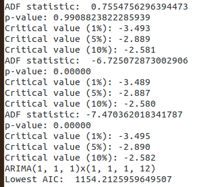
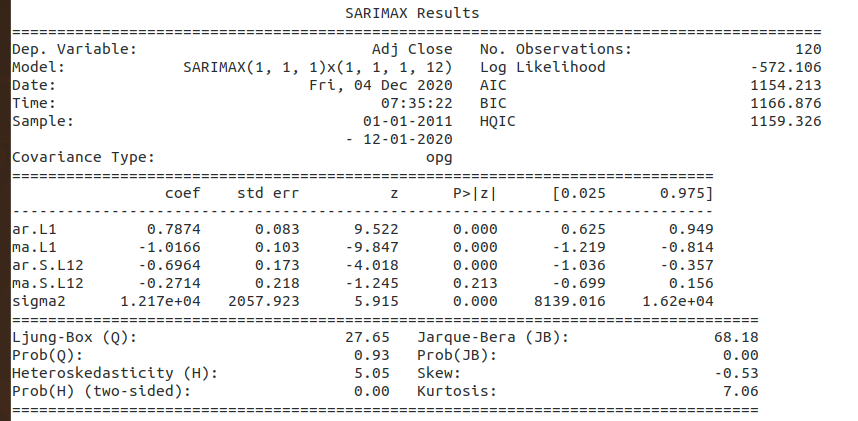
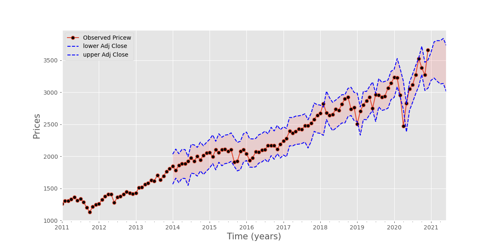
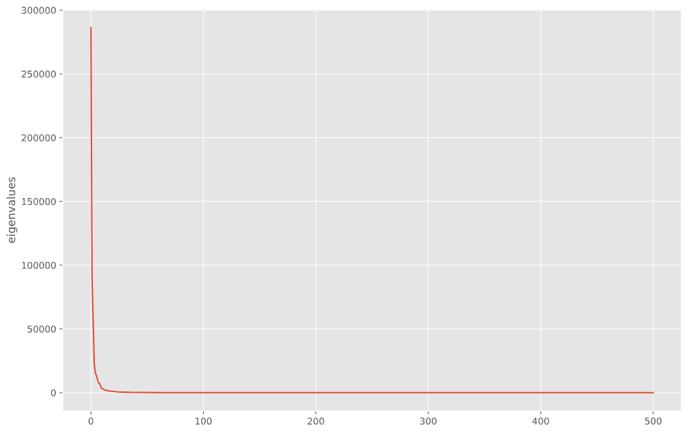
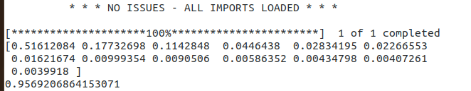

# PredictingTheSP500
### What to do with your money in hard times - a look at some money options
##### Gordon D. Pisciotta

# Money Options:
* Low Returns
    - “Under your mattress”
    - High Yield Savings Account
    - Treasury or Government Bill/Bond
* Risky Assets
    - Cryptocurrency
    - High Capital Investments
    - Real Estate
    - Alternative Assets
    - Private Equity
* Alternative Options ~ A Potential Better Route:
    * Stock Market (S&P 500 Index) - measures performance of 505 publicly listed companies

# Historical Price Of SP500 Index:
* SP500 - 10 years - daily prices

  

# Stationary Time Series Data
* Price movements tend to drift towards some long term mean either upwards or downwards.
* Stationary TS has constant mean/variance/autocorrelation over time
                    

      
 ### Augmented Dicker-Fuller Test
 ##### Null = time series contains unit root and is non-stationary
 * p-value > 0.05 = reject null (nonstationary)
 ##### Alternative - time series does not contain unit root and is stationary
 * p-value ≤ 0.05 = fail to reject null (stationary)
 

# ARIMA & SARIMA
* Fit by Grid Search to find lowest AIC - Fit data to Model
 
   

### PREDICTION:
   
   
* Upper & Lower Bounds of Fitted Parameters (7 year Rolling Perdictions - Trailing)
* 95% Confidence Interval (shaded Section)
* Forcast 6 months into future
    - perdiction widens to reflect loss of certainty in the market outlook

# SUMMARY:
1. Over time the market outperforms other assets
2. Every year your money in your savings account is losing money due to inflation

# LOOKING FORWARD:
1. Generate portfolio from components of SP500
## 2. Build Automated Trading Model to Trade based on Perdictions/Moving Averages

# (1) Kernel-PCA
* Use z-score to normalize data
* Perform Kernel-PCA on the 505 component stocks within the S&P 500 Index
* Generate Outputs:
    * EigenVectors - direction of principal component line 
    * EigenValues - amount of variance each component stock (eigenvector) of the S&P 500 Index generates onto the overall price fluctuations over time

### Reconstruct Kernel-PCA vs SP500 Index (Price)

