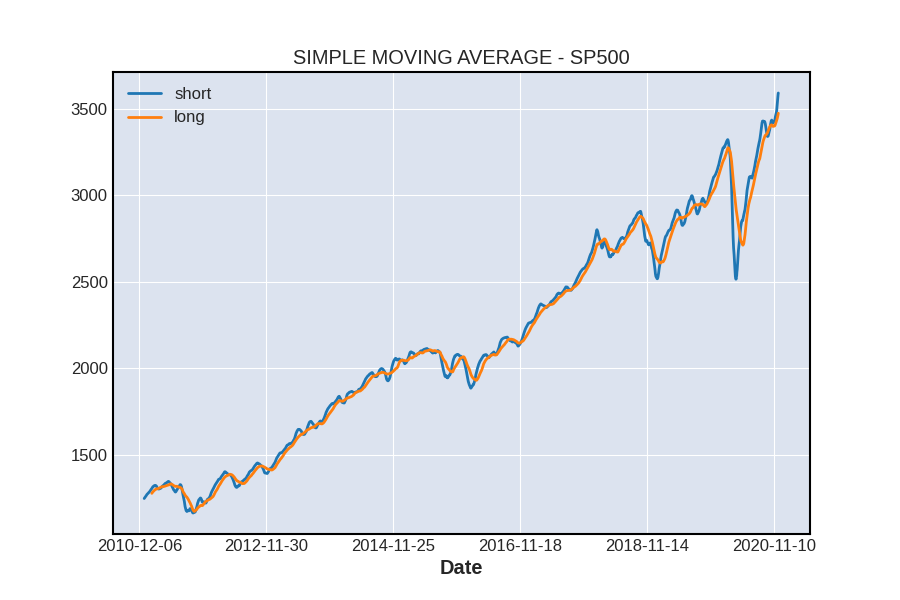

# PredictingTheSP500

## In this volatile year is the stock market a safe bet?
#### Where to put your money with COVID-19 on the loose.  

### Use Time Series Analysis of historical prices for the SP500 Index to perdict the next 6 months of prices.
##### Scrape/Import Historical Data
* SP500 - 10 years - daily prices
* SP500 component stocks for (Kernel-PCA)

# Initial EDA
### ...
     * .
     * .                                                                                       
:--------------------------------------------------------------------------:|:---------------------------------------------------------:
  |  
              |  

# ...
### ...
     * .
     * .
:------------------------------------------:|:------------------------------------------------:
:  |    :

# ...
### ...
     * .
     * .

# ...
### ...
     * .
     * .
:---------------------------------------------------:|:-------------------------------------------------------------------------:
                           |  

# ...
### ...
     * .
     * .
     
 kernelPCA
 
 kPCAvsSP
 
 
 

# ...
### ...
     * .
     * .
 

# ...
### ...
     * .
     * .
:---------------------------------------------------:|:-------------------------------------------------------------------------:
               |  

:---------------------------------------------------:|:-------------------------------------------------------------------------:
                   |  

seasonalDecomp

# ...
### ...
     * .
     * .
     
     MODELASSUMPTIONS
   

# ...
### ...
     * .
     * .
