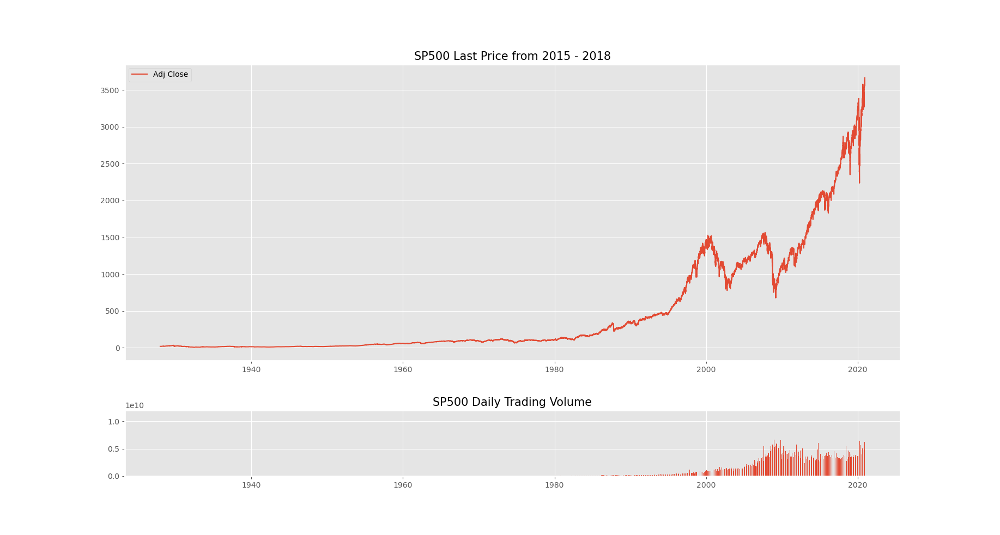

# PredictingTheSP500

## In this volatile year is the stock market a safe bet?
#### Where to put your money with COVID-19 on the loose.  

### Use Time Series Analysis of historical prices for the SP500 Index to perdict the next 6 months of prices.
##### Scrape/Import Historical Data
* SP500 - 10 years - daily prices
* SP500 component stocks for (Kernel-PCA)

# Initial EDA

  
##### Annual Returns Are Concentrated near 0

              
##### Spike in recent volatility

##### CandleStick Plot
* green = closing price > open price
* red = closing price < open price

# Kernel-PCA
### Use z-score to normalize data
#### Perform on Component Stocks within the SP500 Index
##### Outputs:
* EigenVectors - direction of principal component line 
    - does not change during linear transformation
* EigenValues - amount of variance of data in direction with respect to particular eigenvector

 

### Reconstruct Kernel-PCA vs SP500 Index (Price)
  

# Stationary Time Series Data
* Price movements tend to drift towards some long term mean either upwards or downwards.
* Stationary TS has constant mean/variance/autocorrelation over time
* Must do this or potential for Spurious Regression  misleading statistical evidence of relationships between independent non stationary variables

                    

      

# ARIMA & SARIMAX
### Fit by Grid Search to find lowest AIC
### Fit data to Model

 

   

# PREDICTION:
   

# LOOKING FORWARD:
* Precision Model Comparison
* Generate portfolio from components of SP500
* Build Automated Trading Model to Trade based on Perdictions/Moving Averages
